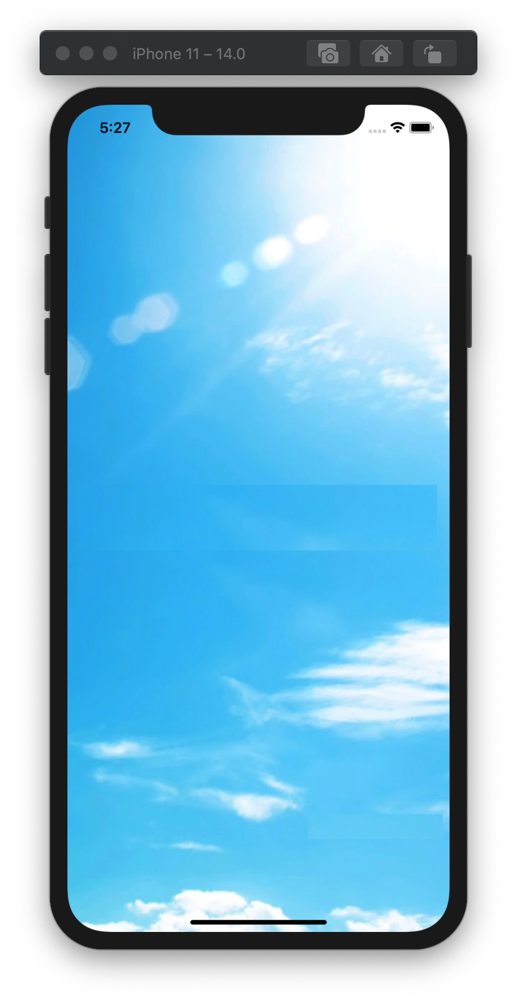
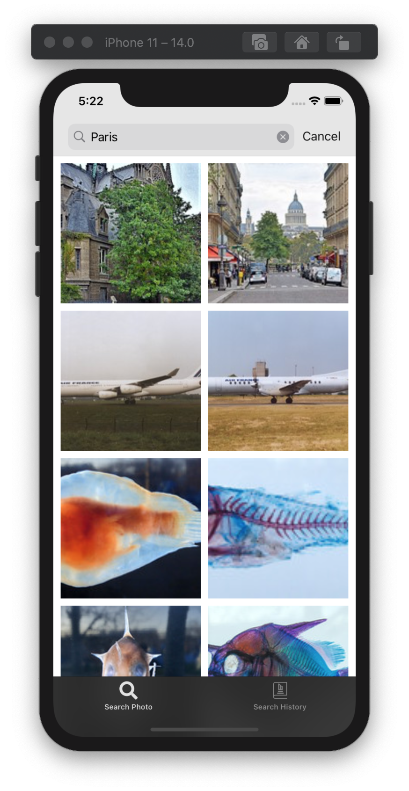
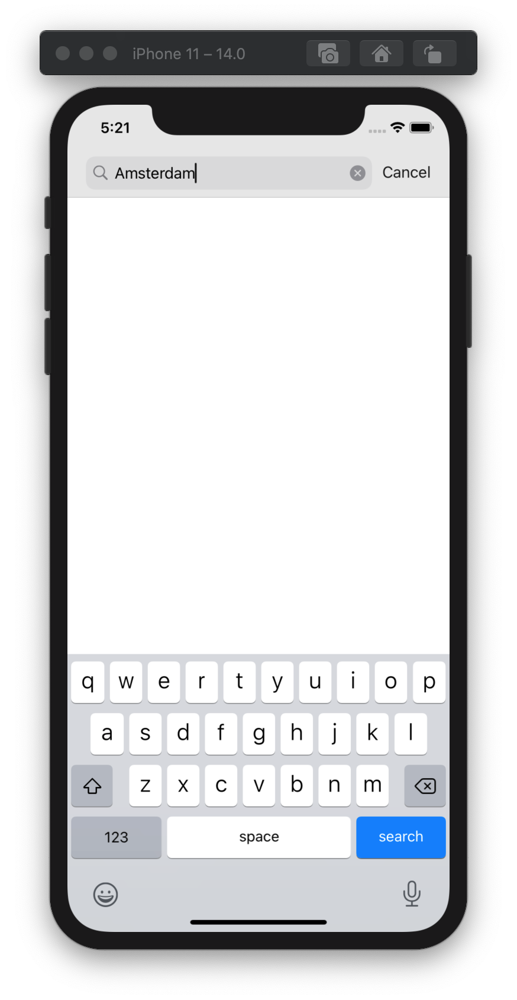
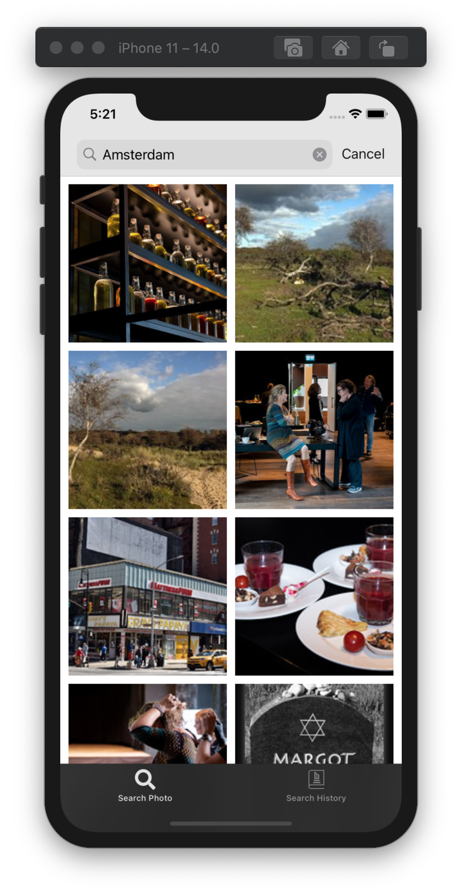
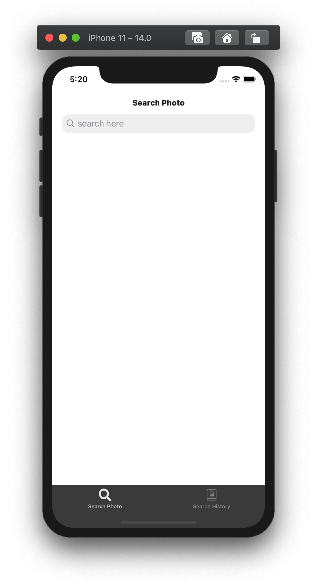
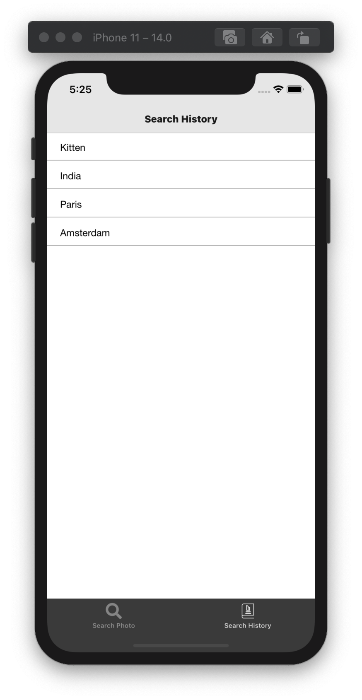
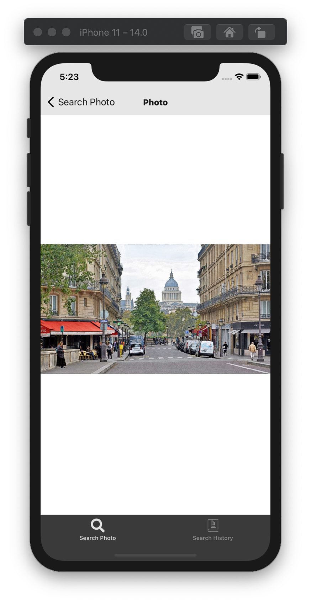
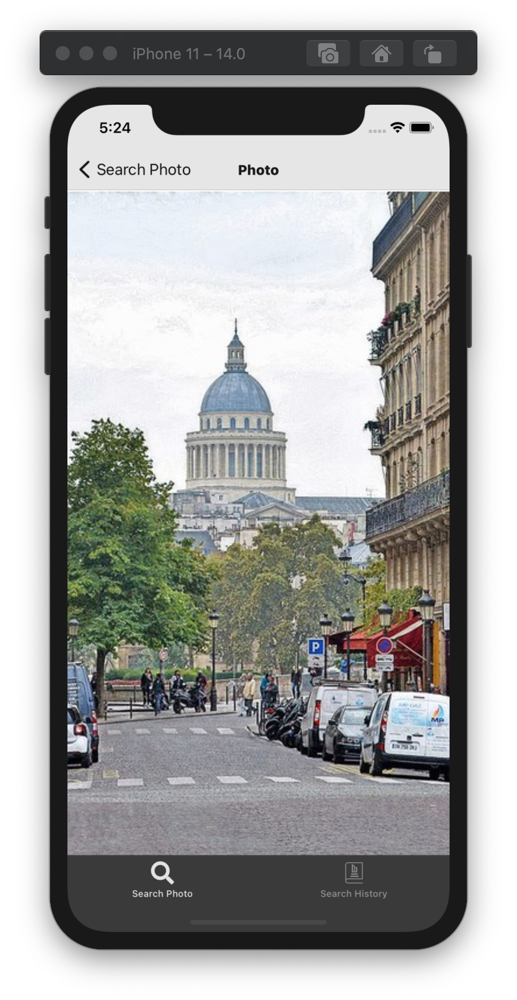
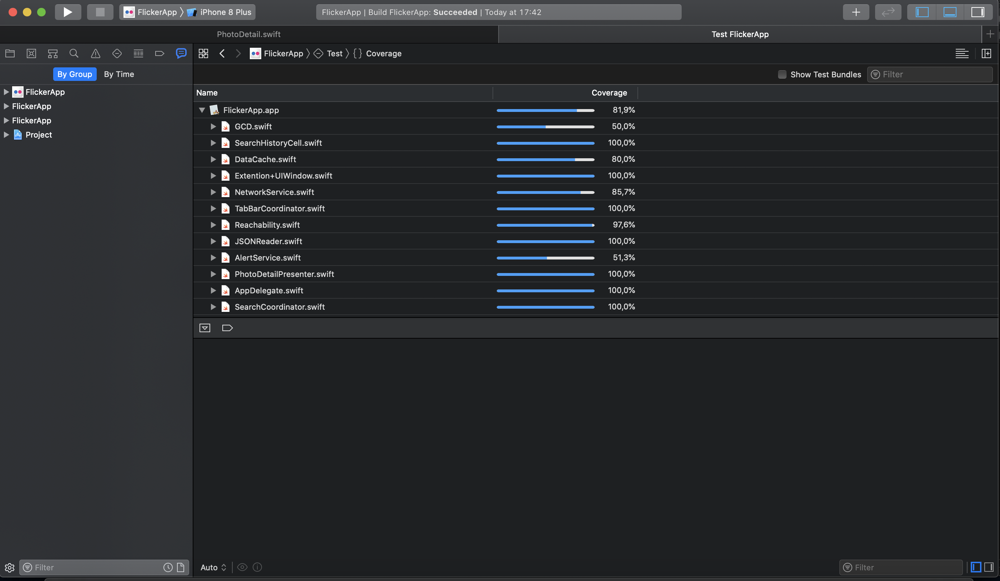
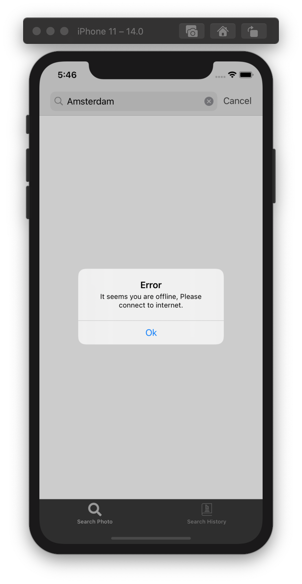

# FlickrApp
Flickr app searches for images using Flickr API based on user's input and displays the images on home screen with endless scrolling. On selecting each photo the app will take the user to the next screen which show the selected image. User can even zoom in/out the image upto 5x. The app even maintains the search history and shows all the recent searches in a list.

### Features
- FlickerApp provides the user the option to search the images based on the input provided in the search box. User gets list of images on Home screen. 
- User can see the photos in a separate screen by seecting each image from the list.
- User will be able to Zoom in/out the images upto 5x.
- The app stores the user's search histroy and shows the list of searched string under Search history tab.
- App supports both light mode.
- App supports portrait mode.
- App has been localized for english and can be extended to support other language.
- The app supports searches in online mode, whereas user can see the search histroy even in offline mode.
- App supports iOS version 13.x and above. Tested on iPhone 11, iPhoneX, iPhone6s with iOS version 13.4 and iOS 14.0.

## Notes
- FlickerApp app gets list of all images from flicker search API. 
- The app will show an error popup "There seems to be some problem. Please try after sometime" in case of any error ocurred during the API call.
- The app is using lazy loading to download the Images which gives smoother UI experience to the user.

## Sample Screens

 

### Prerequisites

You would need a macbook with XCode 11.x installed. I built the app with XCode 11.2.1

## User Guide to use the app
- On Launch, the first view when app starts is the Search screen which consists of Search bar on teh top and two tab items Search and Search Histrory on the bottom.  
- User can type any string (E.g.- Amsterdam, Paris etc) inside the search box and on tapping enter will show the list of images on the home screen with 2 cloumns.
- On tapping each images, it takes the user to next screen with with the photo and user can zoom in/out upto 5x. 
- On tapping the Serach history tab, it will show the list of searched string in 'most recent at the top' manner.

## Technical Details

### Third Party
- No third party library is used.

### App Architecture
- VIPER Architecture is used in the app.
- Network layer is based on protocol oriented design.

### Language
- Swift language has been used.

### Code Structure
Code is divided into following Groups
- APP  group contains the xcode auto generated AppDelegate and custom class Appcoordinator.
- Constants group contains  Constant file which stores all the constants used across the app.
- Utlities contains AlertService protocol, Extension, Helper, Screens, Reachability, Coordinator Protocols. This code is reusable generic code used through out the app.
- Networking group contains all the files related to network layer. It contains sub groups of Reachability, NetworkHandler, NetworkRouting, HTTPHandlers, EndPoints and Services.
- SearchView group contains the *Photo* model and SearchHistroy contains *SearchHistory* model, which being used in the app.
- SearchView group contains the modules with their respective view, Collection view cells, Presenter, Interactor, Coordinator, Entity. 
- SearchView subgroup contains *SearchView* for main Home screen view.  
- SearchHistory subgroup contains *SearchHistory* for showing the list of recently searched strings.

### Unit Tests
- Unit test are written and provide a code coverage of 81.9 percent. see the screenshot attached.

Unit tests are arranged in two subgroups:
- Search contains tests written on View, Presenter, Interactor, Coordinator
- SearchDetail contains tests written on Presenter, Coordinator, View
- SearchHistory contains tests written on Presenter, Coordinator, View
- Network subgroup contains tests written on Network Services
- Utility subgroup contains tests written on utility services
- Mock subgroup contains mock-up classes of Search module.

## Built With
- XCode 11.2.1
- Tested on iPhone 8. (iOS 13.1.3)
